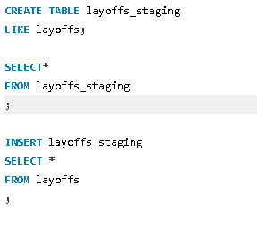

# Layoffs-data
## Layoff dataset cleaning using MSQL

### Introduction.
I found this dataset while working on my project. It contains information on companies from all over the world that laid off their employees between 2020 and 2023, making it an excellent resource for improving my SQL skills
### Steps I followed while cleaning the data
1. Removing Dublicates
2. Standardizing the data
3. Dealing with Null and blank Values
4. Removed unused columns
## Step 1 CREATING A DUBLICATE TABLE 
i assumed that this was a real life work project, so i started by creating a dublicate table so that i could work on it with out  changing the origal table.

## step 2 REMOVING DUBLICATES
I first created a row_number column since the table had no unique_key column i could use.I did this by using a window function

Then i searched for the columns that had duplicates and deleted the dublicates.

## Step 3 STANDARDZING THE DATA
Then i trimmed off the spaces that were before and after the columns and made sure all the columns were in the right format and 

the company names, industy names and country names were written correctly and were standard. 
Next i had to change the date datatype from text to date formate since i imported it as text.

## Step 4 WORKING WITH NULLS AND BLANKS.
Here i transformed all the blanks spaces to nulls so that i could be able to work with them as nulls.
Then i looked looked for the nulls in the industry column that could be populated by looking for companies that were in simiral industry and used joins, to join the ones that were null to the ones that were not null but simillar and this filled the up the nulls. 

Then i lokked for the ones that could not be populated mostly the total_laid_off and the percentage_laid_off and deleted them.

## Step 5 DROPING THE UNNEEDED COLUMNS
Then i droped the row_num column i created at the start of the project since it was no longer needed.

